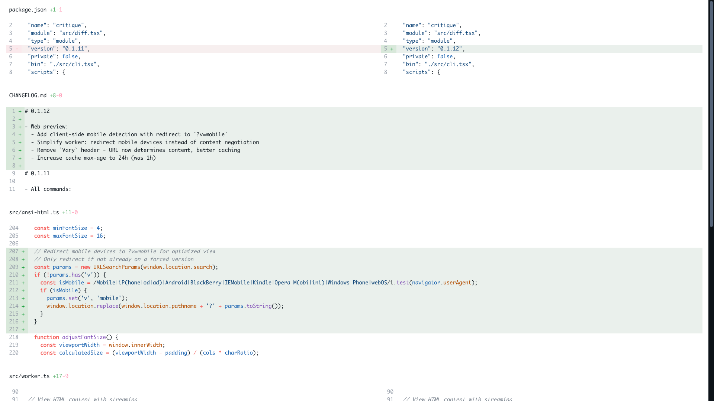

<div align='center'>
    <br/>
    <br/>
    <h3>critique</h3>
    <p>Beautiful diff viewer for terminals, web previews, and agents.</p>
    <br/>
    <br/>
</div>


## Installation

critique requires [Bun](https://bun.sh). It does not run under Node.js.

```bash
# Run directly without installing
bunx critique

# Or install globally
bun install -g critique
```

## Quick Start

Open the current working tree diff in the terminal:

```bash
critique
```

Upload the same diff and get a shareable URL:

```bash
critique --web "Current working tree"
```

Review staged changes:

```bash
critique --staged
critique --staged --web "Staged changes"
```

## Core Diff Commands

critique follows the same mental model as `git diff`.

```bash
# View unstaged changes, including untracked files
critique

# View staged changes
critique --staged

# View changes since a ref
critique HEAD~1
critique main

# View one commit only
critique --commit HEAD~1
critique --commit abc1234

# Compare two refs, PR style
critique main HEAD
critique main feature-branch

# Watch the working tree and refresh on changes
critique --watch

# Filter files by glob pattern
critique --filter "src/**/*.ts"
critique --filter "src/**/*.ts" --filter "lib/**/*.js"
```

## Navigation

| Key | Action |
| --- | --- |
| `←` / `→` | Navigate between files |
| `↑` / `↓` | Scroll up and down |
| `Ctrl+P` | Open file selector dropdown |
| `Option` held | Fast scroll at 10x speed |
| `Esc` | Close dropdown |

## Web Previews

`--web` renders the diff with the same terminal renderer, uploads it to [critique.work](https://critique.work), and prints a shareable URL.

```bash
# Working tree changes
critique --web "Fix auth retry"

# Staged changes
critique --staged --web "Release notes"

# Changes since a ref
critique main --web "Branch changes"

# One commit
critique --commit HEAD --web "Latest commit"

# PR-style branch diff
critique main HEAD --web "Current branch"

# JSON output for scripts
critique --web "Deploy changes" --json
```

Generated URLs look like `critique.work/v/<id>`.



### Web Preview Options

| Flag | Description | Default |
| --- | --- | --- |
| `--web [title]` | Generate and upload a web preview | `Critique Diff` |
| `--staged` | Show staged changes | none |
| `--commit <ref>` | Show changes from a specific commit | none |
| `--cols <n>` | Desktop render width | `240` |
| `--mobile-cols <n>` | Mobile render width | `100` |
| `--filter <pattern>` | Filter files by glob, can be repeated | none |
| `--theme <name>` | Use a fixed theme instead of auto light and dark mode | none |
| `--open` | Open the URL in your browser | none |
| `--json` | Print `{ url, id, files }` for scripts | none |

### How Web Uploads Work

```text
┌─────────────────────────────────────┐
│ git diff                            │
└─────────────────────────────────────┘
                   │
                   ▼
┌─────────────────────────────────────┐
│ opentui test renderer               │
└─────────────────────────────────────┘
                   │
                   ▼
┌─────────────────────────────────────┐
│ HTML variants and raw patch         │
└─────────────────────────────────────┘
                   │
                   ▼
┌─────────────────────────────────────┐
│ critique.work upload                │
└─────────────────────────────────────┘
                   │
                   ▼
┌─────────────────────────────────────┐
│ shareable URL, optional .patch      │
└─────────────────────────────────────┘
```

The CLI does **not** generate a local HTML file. It uploads to `critique.work`. Local HTML export is tracked separately in [issue #42](https://github.com/remorses/critique/issues/42).

Uploaded diffs expire after 7 days unless you use a license key. Identical diffs reuse the same content hash URL.

## Raw Patch Access

Every `--web` upload also stores the raw unified diff. Append `.patch` to any critique URL to fetch it.

```bash
CRITIQUE_URL='https://critique.work/v/<id>'

# View the patch in your terminal
curl "$CRITIQUE_URL.patch"

# Apply the patch directly to your repo
curl -s "$CRITIQUE_URL.patch" | git apply

# Reverse the patch
curl -s "$CRITIQUE_URL.patch" | git apply --reverse
```

## AI-Powered Diff Explanation

`critique review` asks an agent to explain a diff in a readable order. It can use [OpenCode](https://opencode.ai) or [Claude Code](https://www.anthropic.com/claude-code).

```bash
# Review unstaged changes with OpenCode
critique review

# Use Claude Code instead
critique review --agent claude

# Review staged changes
critique review --staged

# Review changes since a ref
critique review HEAD~1
critique review main

# Review one commit
critique review --commit HEAD~1

# Include coding session context
critique review --agent opencode --session <session-id>
critique review --agent claude --session <session-id>

# Upload the review as a web preview
critique review --web
critique review --web --open
```

### Review Options

| Flag | Description |
| --- | --- |
| `--agent <name>` | AI agent to use: `opencode` or `claude` |
| `--staged` | Review staged changes |
| `--commit <ref>` | Review one commit |
| `--session <id>` | Include session context, can be repeated |
| `--web` | Upload the review as a web preview |
| `--pdf [filename]` | Generate a PDF. See the [e-reader guide](docs/e-reader-guide.md) |
| `--open` | Open the generated URL or PDF |
| `--filter <pattern>` | Filter files by glob |

## Git Difftool Integration

Configure critique as your git difftool:

```bash
git config --global diff.tool critique
git config --global difftool.critique.cmd 'critique difftool "$LOCAL" "$REMOTE"'
```

Then run:

```bash
git difftool HEAD~1
```

## Lazygit Integration

Use critique as a custom pager in [lazygit](https://github.com/jesseduffield/lazygit):

```yaml
# ~/.config/lazygit/config.yml
git:
  pagers:
    - pager: critique --stdin
```

For details, see [lazygit's Custom Pagers documentation](https://github.com/jesseduffield/lazygit/blob/master/docs/Custom_Pagers.md).

## Pick Files from Another Branch

`critique pick` lets you apply selected files from another branch to the current checkout.

```bash
critique pick feature-branch
```

Selected files are applied as patches. Deselected files are restored.

## Selective Hunk Staging

`critique hunks` gives scripts and agents a stable alternative to `git add -p`.

```bash
# List unstaged hunks with stable IDs
critique hunks list

# List staged hunks
critique hunks list --staged

# Filter by file pattern
critique hunks list --filter "src/**/*.ts"

# Stage one hunk by ID
critique hunks add 'src/main.ts:@-10,6+10,7'

# Stage multiple hunks
critique hunks add 'src/main.ts:@-10,6+10,7' 'src/utils.ts:@-5,3+5,4'
```

Hunk IDs use this format:

```text
file:@-oldStart,oldLines+newStart,newLines
```

The ID comes from the unified diff `@@` header, so it stays stable across runs.

## E-Ink Reading

Generate PDFs from diffs and AI reviews to read on Kindle or Boox e-readers.

```bash
critique --pdf
critique review --pdf
critique review main --pdf --open
```

The PDF preserves syntax highlighting and diff formatting. Email it to your Kindle, drop it in BooxDrop, or save it to a synced Google Drive folder. See [docs/e-reader-guide.md](docs/e-reader-guide.md) for setup details.

## Agent Skill

This package ships a skill file that teaches AI coding agents how to use critique for diff URLs, PDFs, images, and selective hunk staging.

```bash
npx -y skills add remorses/critique
```

## Features

- **Syntax highlighting:** powered by [Tree-sitter](https://tree-sitter.github.io/) via [opentui](https://github.com/sst/opentui)
- **Split view:** side-by-side comparison for wide terminals, unified view on narrow terminals
- **Word-level diff:** highlights exact word changes inside modified lines
- **File navigation:** quick file switcher with fuzzy search
- **Click to open:** click line numbers to open in your editor with `REACT_EDITOR`
- **Watch mode:** refreshes as you edit files
- **Web previews:** hosted shareable URLs on [critique.work](https://critique.work)
- **Raw patches:** every web preview has a `.patch` endpoint
- **PDF output:** optimized for code review away from the terminal

## Supported Languages

TypeScript, JavaScript, TSX, JSX, JSON, Markdown, HTML, CSS, Python, Rust, Go, Java, C, C++, C#, Ruby, PHP, Scala, Haskell, Julia, OCaml, Clojure, Swift, Nix, YAML, and Bash.

## Configuration

| Environment Variable | Description | Default |
| --- | --- | --- |
| `REACT_EDITOR` | Editor command for click-to-open | `zed` |
| `CRITIQUE_WORKER_URL` | Custom worker URL for web previews | `https://critique.work` |

## Ignored Files

Lock files are automatically hidden from diffs:

- `pnpm-lock.yaml`
- `package-lock.json`
- `yarn.lock`
- `bun.lockb`
- `bun.lock`
- `Cargo.lock`
- `poetry.lock`
- `Gemfile.lock`
- `composer.lock`

Files with more than 6000 lines of diff are also hidden for performance.

## Built With

- [opentui](https://github.com/sst/opentui): React-based terminal UI framework
- [Tree-sitter](https://tree-sitter.github.io/): syntax highlighting
- [diff](https://github.com/kpdecker/jsdiff): diff algorithm
- [Hono](https://hono.dev/): web framework for the preview worker

## Sponsors

<a href="https://coderabbit.link/remorses" target="_blank" rel="noopener noreferrer">
  
</a>

Sponsored by [CodeRabbit](https://coderabbit.link/remorses).

## License

MIT
